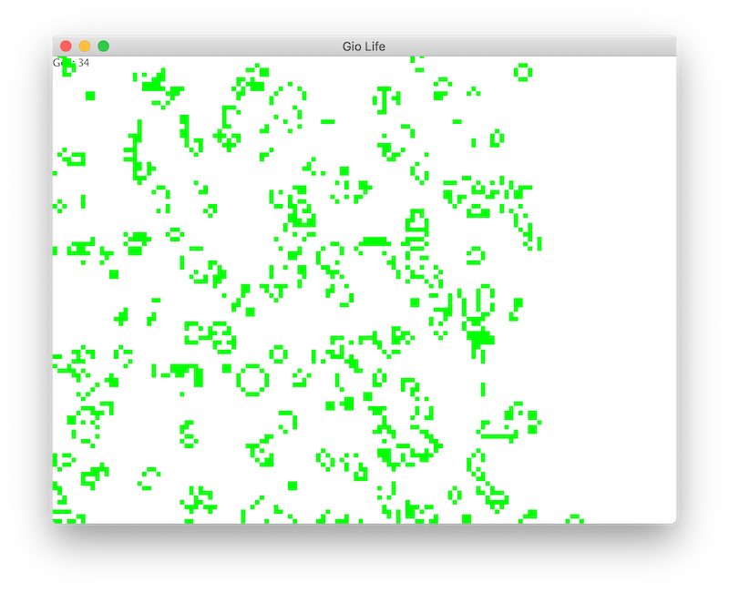
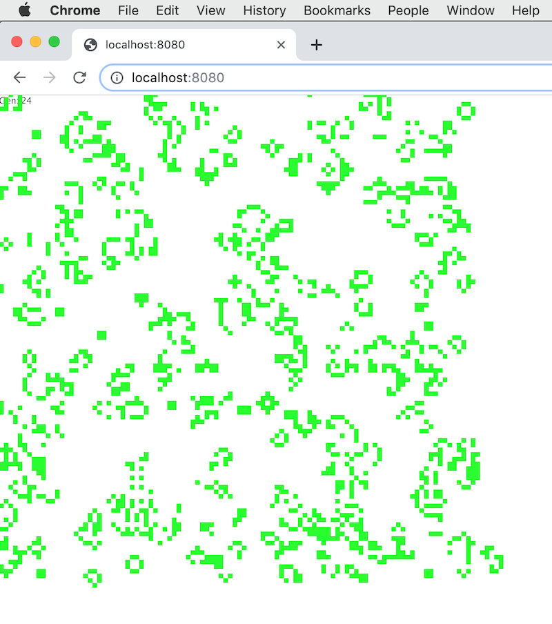

# go-life

Conway's Game of Life in Go, cross-platform  
Uses [Gio](https://git.sr.ht/~eliasnaur/gio) by [@EliasNaur](https://github.com/eliasnaur).

## To build

For the desktop app, Go 1.12 is fine.

To build the web version (which you don't have to do if you only want to run it), you'll need 1.13 / go tip.  (Explaining "go tip" is beyond the scope of this readme, sorry.)

Again: the www/ directory in the repo is ready to run, no need to (re)build it.  **So if you just want to try it**, you don't need "go tip".

### Desktop

```bash
% export GO111MODULE=on
% go run life.go
```

### Browser:

#### Locally

```bash
% go get github.com/shurcooL/goexec
% goexec 'http.ListenAndServe(":8080", http.FileServer(http.Dir("www")))'
```

Browse to http://localhost:8080.

#### From Github

Browse to http://theclapp.github.io/go-life/www/.  
May take a few moments to download on your first visit; ~4 mb download.

## Hotkeys

These work in the desktop app and in the browser.

* `q` to quit (in the browser this just halts execution)
* `r` to restart the universe with random cells
* `-` (minus key) to reduce the scale (zoom out)
* `+` to increase the scale (zoom in) (`=` also works)
* `<` or `,` to slow down the generations
* `>` or `.` to speed them up

You can also click-and-drag or scroll around.

You can't enter or save patterns yet.

## Screenshots

### macOS



### Chrome


